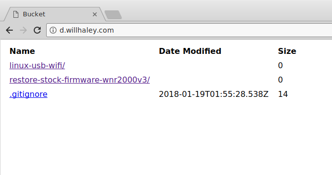

# Google Cloud Bucket Directory List

# Why?

I could not find any simple solution to allow me to list the contents of my Google Cloud bucket via web UI.

# What?

This **only supports** listing files with URLs, size, and dates. You have to copy `index.html` and `index.js` to _every_ subdirectory where you want to list contents.

[Nolan Lawson's project](https://nolanlawson.com/2013/11/25/s3-bucket-listing-thats-easier-on-the-eyes/) was the best starting off point and provided the most inspiration for my implementation.

# Installation

You **must** update the `index.html` file to use the proper `bucketName` for your site.

Upload the `index.html` and `index.js` files to your bucket.

Click `Edit website configuration` on your bucket and set `index.html` as the `Main page`.

Add `allUsers` to the `Storage` -> `Storage Object Viewer` role for the permissions on your bucket.

